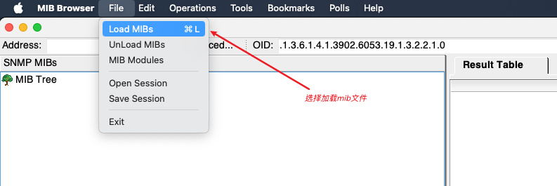
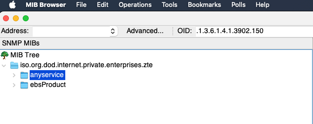
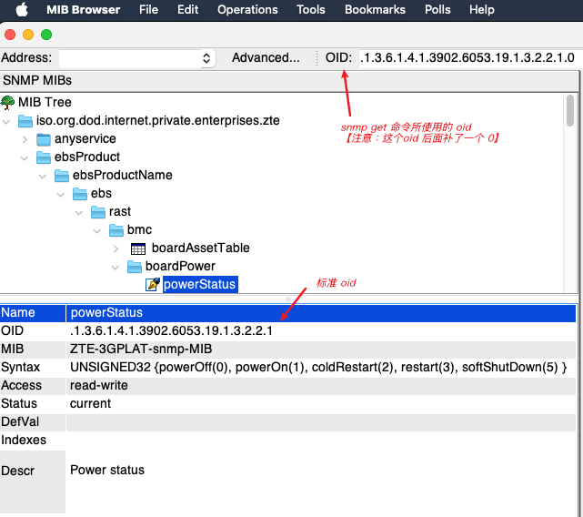
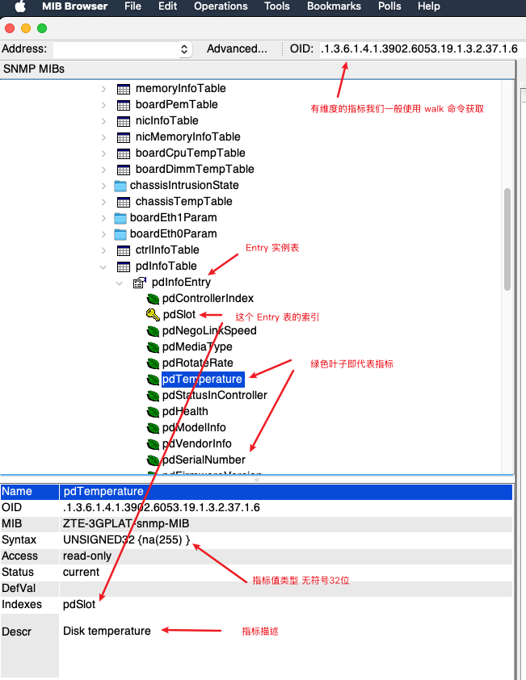

# snmp_exporter 开发文档
## 本文涵盖的范围
目标旨在指导开发 snmp_exporter 所适用的 config.yaml 文件。<p>
通过使用 [snmp_exporter](https://github.com/prometheus/snmp_exporter)编译产生的二进制文件配合我们手动编写的 config.yaml 配置文件从而达到获取硬件指标的目的
## 前置条件
### mib是什么 & mib文件怎么去读取
#### mib是什么
mib文件其实就是一个涵盖了很多 oid 的一个文本，其拥有一定的特殊格式。文本中指出了特定的 oid 获取到的数据的类型（ObjectString、int32、gauge等）；通常一个 mib 文件往往也会需要导入其他基础的 mib<p>
> 部分截取内容如下
```
ZTE-3GPLAT-snmp-MIB DEFINITIONS ::= BEGIN

IMPORTS
    rast
        FROM ZTE-PLAT-SMI                                        # FROM ZTE-PLAT-SMI 表明当前 mib 文件需要依赖外部 mib ZTE-PLAT-SMI
    enterprises,IpAddress, Integer32, 
    OBJECT-TYPE,MODULE-IDENTITY
        FROM SNMPv2-SMI                              -- RFC2578  # FROM SNMPv2-SMI 表明需要依赖外部 mib SNMPv2-SMI 
    RowStatus, DisplayString
        FROM SNMPv2-TC;                              -- RFC2579  # FROM SNMPv2-TC 表明需要依赖外部 mib SNMPv2-TC

bmc MODULE-IDENTITY
    LAST-UPDATED      "202411020000Z"                    
    ORGANIZATION      "rast working group,zte Telecom. Co." 
    CONTACT-INFO      ""
    DESCRIPTION       
        "The Module for zte rast bmc."
    ::= { rast 2 }

-- 1.3.6.1.4.1.3902.6053.19.1.3.2.2
boardPower OBJECT IDENTIFIER ::= {bmc 2}
-- 1.3.6.1.4.1.3902.6053.19.1.3.2.2.1                                                       # powerStatus 的 oid
powerStatus OBJECT-TYPE                                                                     # 返回的数据类型为 无符号int32位 并且标注了每一个值所代表的电源状态
    SYNTAX      Unsigned32 {
                   powerOff(0), -- get/set value
                   powerOn(1), -- get/set value
                   coldRestart(2), -- set value. It means power off first, then power on
                   restart(3), -- set value. This operation do not power off the device
                   softShutDown(5) -- set value
               }
    MAX-ACCESS  read-write
    STATUS      current
    DESCRIPTION                                                                             # 指标描述
        "Power status
"
    ::= {boardPower 1}
```

--- 
#### mib文件看起来这么绕，我该怎么正确去读取呢？——— [mib浏览器](https://www.ireasoning.com/mibbrowser.shtml)
在前文说过，一个mib库往往由多个基础mib文件组成，那么如果我们手动的去一章一章读取，这个效率未免也太过底下；所以我们可以借助 [mib浏览器](https://www.ireasoning.com/mibbrowser.shtml)将难以阅读的mib库转化为 ”明文|可阅读“的形式；使用方式如下<p>
<p>
加载mib文件后我们便可以看到mib文件中所描述的各种指标以及对应的指标的数据类型<p>
<p>


### 有维度的指标 & 无维度的指标（有维度的oid以及无维度的oid）怎么区分？
一个mib库里面包含很多 oid，并且有些 oid是带有维度的；有些则不带维度。那么我们应该怎么去区分这个指标是有维度还是没有维度呢？<p>
我们可以通过mib浏览器中存放的指标他的具体的位置来判断。

#### 无维度指标
例如我们上图截取出来的 powerStatus 就是一个无维度指标；这个指标只有一个”节点“，并且在指标的描述中对应的 indexes 为空。<p>
**对于这种无维度的指标，我们通常直接使用 get 命令获取对应的 oid 的内容**<p>


#### 有维度指标
有维度的指标通常存放在一个 **Entry**表下面，这个表下面的所有指标表示的是一个实例所拥有的信息。<p>
**对于这种有维度的指标，我们通常直接使用 walk 命令获取对应的 oid 的内容**<p>


#### （注意：无维度指标在尝试使用 snmpget 的时候需要在具体的 oid 后面进行补零；有维度的指标在尝试使用 snmpwalk 的时候不需要在具体的 oid 后面进行补零。）

### 配置文件编写&模版
supportFile 文件夹下存放了 huawei硬件的mib文件以及编写好的采集对应指标的配置文件。<p>
格式可参考 supportFile/Huawei_snmp_file/huawei.yaml<p>

使用时可以通过 mib 浏览器打开给出的 mib 文件；并且对照着编写好的 huawei.yaml 配置文件以供理解。